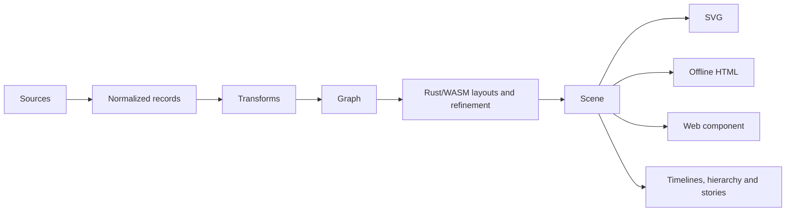

# Constellation architecture

Temporal Stack adds a validated Scene v1 attachment referencing Timeline frames.
Existing artifact layouts supply shared anchors; Rust retains per-frame graph
relationships. A shared JavaScript projection composes local XY planes along the
year/depth axis for SVG and offline interaction. See [Temporal Stack](temporal-stack.md).

The platform separates source loading, normalization, declarative transformation, graph projection, layout, scene compilation and rendering:

JavaScript coordinates sources, bounded host caches, declarative options and DOM interaction. Rust/WASM remains the canonical engine for its existing geometry, refinement and traversal algorithms. Existing artifact and organization layout adapters feed that engine; they are not replaced wholesale. HTML, Studio and the component use the same compiled positions and SVG renderer, with DOM interpolation between already-computed states.

| Location | Responsibility |
| --- | --- |
| `packages/core` | Dependency-free ESM data, graph/layout, scene, renderer and host APIs, with WASM |
| `packages/web-component` | Browser custom element consuming core and its shared runtime |
| `packages/source-json` | Independently consumable JSON source adapters |
| `packages/themes` | Versioned declarative Look presets |
| `src/preview.mjs`, `src/studio-*` | Vanilla DOM Studio application and editors |
| `src/cli.mjs`, `action.yml` | Node CLI and GitHub Action integration |
| `rust/constellation-core` | Native-tested computational engine compiled to WASM |

The SVG/HTML renderers remain core entry points rather than separate packages: they share the scene validator and offline engine, and separating them now would add release/dependency coordination without isolating a dependency. Studio and CLI remain application entry points rather than empty wrapper packages. Package directories are generated from source; edit `src/` and run the build scripts. No runtime framework was introduced.

Scene API v1 includes immutable-by-convention JSON snapshots with versioned temporal, hierarchy and Story attachments. Hosts clone inputs/results at extension and cache boundaries. Source, layout, pipeline, timeline and navigation caches have explicit bounds/statistics; no global executable-plugin registry exists. Cancellation reaches asynchronous sources and is checked around synchronous compile stages. Synchronous WASM work cannot be preempted mid-call.

Determinism requires identical input data, config, seed, engine and explicit reference date. Historical snapshots are supplied evidence, while retrospective views based on current metadata are labelled accordingly. Serialization orders object keys and compilation stabilizes node/edge/layer identity. The original SVG fixtures remain regression tests.

See the [baseline architecture](architecture-baseline.md) for the original 2.0 boundaries and [migration guide](migration-v3.md) for supported compatibility.

Core and the web component release together at 3.1.2. JSON sources and themes are independently versioned packages at 1.1.0, reflecting additive v2 descriptors/adapters without changing their legacy exports. Theme pack content versions remain 1.0.0.
