# Example designs

Import a JSON file into the studio, or use it with the CLI/Action. These previews use synthetic projects and fixed dates; run `node scripts/generate-examples.mjs` to reproduce them without GitHub API requests.

| Design | Config | Preview |
| --- | --- | --- |
| Deep Space · Galaxy clusters, seeded colors, activity glow | [deep-space.json](deep-space.json) |  |
| Terminal · balanced rings, squares, scanlines | [terminal.json](terminal.json) |  |
| Minimal · monochrome, transparent, no motion | [minimal.json](minimal.json) |  |
| Solar System · major projects, language colors, mixed shapes | [solar-system.json](solar-system.json) |  |
| Milky Way · seeded stars, depth and subtle twinkling | [starfield.json](starfield.json) |  |

| Active Developer · language colors and public-activity comet trails | [active-developer.json](active-developer.json) |  |

Use **Randomize design** for another coordinated starting point. Enable **Include motion** for a randomized animation. Choose the allowed **Animation parts**, then save its `v5:…` code to replay the recipe, or download JSON to keep all subsequent changes. Existing `v1:…` codes retain their classic dust background. Existing `v2:` codes retain their starfield recipe. See the [design guide](../docs/designs.md).

Active Developer uses [synthetic public events](fixtures/public-events.json) and a fixed `activityMetricDate`. Remove that date for live daily generation.

### Coding Rhythm

[Night Owl](night-owl.json) adds a subtle 24-hour orbit to Deep Space / Galaxy with comet trails. [Weekend Builder](weekend-builder.json) uses an active arc and labeled weekday stars. Both use deterministic fixtures, not live data.

### History & Evolution

These examples use [synthetic history fixtures](fixtures/history.mjs), including project creation dates, lifecycle states, weekly public events and external pull requests. Regenerate them offline with `node scripts/generate-examples.mjs`. Remove `referenceDate` and `activityMetricDate` for live daily generation.

| Design | Configuration | Preview |
| --- | --- | --- |
| Developer History · language eras and contribution orbit | [developer-history.json](developer-history.json) |  |
| Open Source Explorer · public contributions beyond the main system | [open-source-galaxy.json](open-source-galaxy.json) |  |
| Time Machine · 2012–2026 growth, with a static latest view for reduced motion | [time-machine.json](time-machine.json) |  |
| Stellar Ages · newborn, active, mature, quiet, dormant, archived | [stellar-ages.json](stellar-ages.json) |  |

See the [history guide](../docs/designs.md#history--evolution) for data limitations and configuration.

## Organization examples

Synthetic community examples: [community galaxy](organization-community.json), [user-to-organization map](organization-user.json), and [era rings](organization-eras.json). Their SVGs are in `gallery/`; regenerate with `node scripts/generate-examples.mjs`. See [organization documentation](../docs/organizations.md) for real-account setup and scan coverage.
